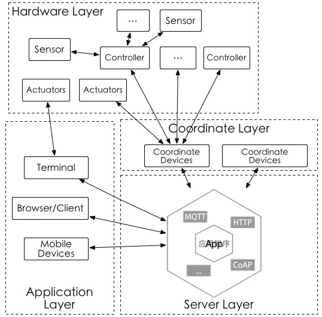

#Awesome Internet Of Things

##Framework(框架)

1. [Cylon](https://github.com/hybridgroup/cylon)(JavaScript, robotics, physical computing, IoT)
2. [johnny-five](https://github.com/rwaldron/johnny-five)(JavaScript Robotics and IoT programming framework, developed at Bocoup, Firmata Protocol)
3. [GoBot](https://github.com/hybridgroup/gobot)(Golang framework for robotics, physical computing, and the Internet of Things)

##Library[库]

###SDK

[Microsoft Azure IoT SDK](https://github.com/Azure/azure-iot-sdks)

###Arduino

1. [Windows Remote Arduino](https://github.com/ms-iot/remote-wiring)(Remote "Arduino Wiring" interface for Windows 8.1, Windows Phone 8.1 and Windows 10. Used to control an Arduino from a Universal Windows Platform application.)
2. [WiringPi](https://github.com/WiringPi/WiringPi)(Gordon's Arduino wiring-like WiringPi Library for the Raspberry Pi)

##OS(操作系统)

1. [ARM mbed](http://mbed.org/)(The ARM® mbed™ IoT Device Platform provides the operating system, cloud services, tools and developer ecosystem to make the creation and deployment of commercial, standards-based IoT solutions possible at scale.)
2. [Snappy Ubuntu Core](http://developer.ubuntu.com/en/snappy/)(Canonical, A new, transactionally updated Ubuntu for clouds and devices.)
3. [Contiki](http://www.contiki-os.org/)(The Open Source OS for the Internet of Things)
4. [Raspbian](http://raspbian.org/)(Raspbian is a free operating system based on Debian optimized for the Raspberry Pi hardware.)
5. [RIOT](http://www.riot-os.org/)(The friendly Operating System for the Internet of Things)
6. [RT-Thread](https://github.com/RT-Thread/rt-thread)(ARM Cortex-M0, Cortex-M3/4/7, or a rich feature system like ARM Cortex-A8, ARM Cortex-A9 DualCore)
7. [TinyOS](https://github.com/tinyos/tinyos-main)(designed for low-power wireless devices, such as those used in sensor networks, ubiquitous computing, personal area networks, smart buildings, and smart meters)
8. [Brillo](https://developers.google.com/brillo/) (Brillo extends the Android platform to all your connected devices)
9. [NodeOS](https://github.com/nodeos/nodeos)(Lightweight operating system using Node.js as userspace)

##Platform (平台)

1. [Lan](https://github.com/phodal/lan)
2. [Canopy](http://canopy.link/)
3. [Chimera IoT](https://chimeraiot.com/init/default/developers)
4. [DeviceHive](https://github.com/devicehive/)
5. [Distributed Services Architecture](http://iot-dsa.org/) (DSA)
6. [Pico Labs](https://github.com/Picolab/) (Kynetx open source assigned to Pico Labs)
7. [M2MLabs Mainspring](http://www.m2mlabs.com/)
8. [Nimbits](http://www.nimbits.com/index.jsp)
9. [Open Source Internet of Things](http://osiot.org/) (OSIOT)
10. [prpl Foundation](http://prplfoundation.org/)
11. [SiteWhere](http://www.sitewhere.org/)
12. [Spark](http://spark.github.io/)
13. [Clavin](https://github.com/EricssonResearch/calvin-base)(Ericsson Research)
14. [IoT.js](https://github.com/Samsung/iotjs) (JavaScript, Samsung)

##APIs

1. [BipIO](https://bip.io/)
2. [Qeo Tinq](https://github.com/brunodebus/tinq-core)
3. [Zetta](http://www.zettajs.org/)
4. [1248.io](http://wiki.1248.io/doku.php)

##Middleware(中间件)
1. [Kaa](https://github.com/kaaproject/kaa)(Kaa open-source middleware platform for building, managing, and integrating connected products with the Internet of Everything.)
2. [OpenIoT](https://github.com/OpenIotOrg/openiot) (The OpenIoT middleware infrastructure will support flexible configuration and deployment of algorithms for collection)

##Toolkits inlucde Non-OS(工具集)
1. [KinomaJS](https://github.com/Kinoma/kinomajs)(A JavaScript runtime optimized for the applications that power IoT devices.)
2. [IoT Toolkit](https://github.com/connectIOT/iottoolkit)(Reference implementation of the smart object API
)

##Data visualization(数据可视化)
1. [Freeboard](https://github.com/Freeboard/freeboard)(A damn-sexy, open source real-time dashboard builder for IOT and other web mashups. A free open-source alternative to Geckoboard.)
2. [ECharts](http://echarts.baidu.com)(Enterprise Charts 商业产品图表库)
3. [HighCharts](https://github.com/highslide-software/highcharts.com)(Highcharts JS, the JavaScript charting framework)
4. [D3.JS](https://github.com/mbostock/d3)(A JavaScript visualization library for HTML and SVG)

##Hardware(硬件)

1. [Arduino](http://www.arduino.cc/)(open-source electronics platform based on easy-to-use hardware and software.)
2. [Raspberry Pi](https://www.raspberrypi.org/)(a tiny and affordable computer that you can use to learn programming through fun, practical projects)
3. [BeagleBone](http://beagleboard.org/getting-started/)
4. [Intel Galileo](http://www.arduino.cc/en/ArduinoCertified/IntelGalileo)
5. [NodeMCU](http://www.nodemcu.com/)
6. [WeIO](http://we-io.net/hardware/)
7. [WIZnet](http://wizwiki.net/wiki/doku.php)
8. [Microduino](https://www.microduino.cc/)
9. [Pinoccio](https://pinocc.io/)
10. [Pinocc](https://pinocc.io/)
11. [openPicus FlyportPro](http://www.openpicus.com/site/tools)
12. [Tessel](https://tessel.io/)(Tessel is a completely open source and community-driven IoT and robotics development platform.)

##Home automation(智能家居)
1. [Home Gateway Initiative](http://www.homegatewayinitiative.org/) (HGI)
2. [Ninja Blocks](https://developers.ninja/)
3. [openHAB](http://www.openhab.org/)
4. [Eclipse SmartHome](http://eclipse.org/smarthome/)
5. [PrivateEyePi](http://projects.privateeyepi.com/)
6. [RaZberry](http://razberry.z-wave.me/)
7. [The Thing System](http://thethingsystem.com/index.html)

##Robotics(机器人)

##Mesh networks

1. [Open Garden](https://opengarden.com/)
2. [OpenWSN](http://www.openwsn.org/)

##Others

1. [Node-RED](https://github.com/node-red/node-red)(IBM)(A visual tool for wiring the Internet of Things)

##Language

1. [ELIoT](https://github.com/c3d/eliot)(Extensible Language for the Internet of Things)
2. [JerryScript](http://samsung.github.io/jerryscript/) (A JavaScript engine for Internet of Things)

##Protocol Library

###Others

[mbed TLS](https://github.com/ARMmbed/mbedtls)(An open source, portable, easy to use, readable and flexible SSL library)

###MQTT

1. [Mosquitto](http://mosquitto.org/)(MQTT)(An Open Source MQTT v3.1/v3.1.1 Broker)

###CoAP

1. [Python CoAP](https://github.com/openwsn-berkeley/coap)(A CoAP Python library)
2. [Node CoAP](https://github.com/mcollina/node-coap)(node-coap is a client and server library for CoAP modelled after the http module.)
3. [Go CoAP](https://github.com/dustin/go-coap)(Implementation of CoAP in go.)
4. [CoAP.NET](https://github.com/smeshlink/CoAP.NET)(A C# implementation of the CoAP protocol)
5. [txThings](https://github.com/siskin/txThings)(CoAP library for Twisted framework)
6. [microcoap](https://github.com/1248/microcoap)(A small CoAP implementation for microcontrollers)
7. [Californium](https://github.com/eclipse/californium)(Californium is a Java implementation of CoAP for the IoT backend and less constrained IoT devices. )

##Tools

1. [Paho](http://www.eclipse.org/paho)(The Paho project provides open-source client implementations of MQTT and MQTT-SN messaging protocols aimed at new, existing, and emerging applications for Machine‑to‑Machine (M2M) and Internet of Things (IoT).)
2. [Smart.js](https://github.com/cesanta/smart.js)(ESP8266)

### Resources-websites-projects
- [Hackday](https://hackaday.io/projects)
- [Instructables - tech](http://www.instructables.com/tag/type-id/category-technology/)
- [Hackster](http://www.hackster.io/)

##Others

Thanks to:

	project  : opensource-iot
	repo age : 11 days
	active   : 6 days
	commits  : 13
	files    : 1
	authors  :
		13	Fengda Huang  100.0%
